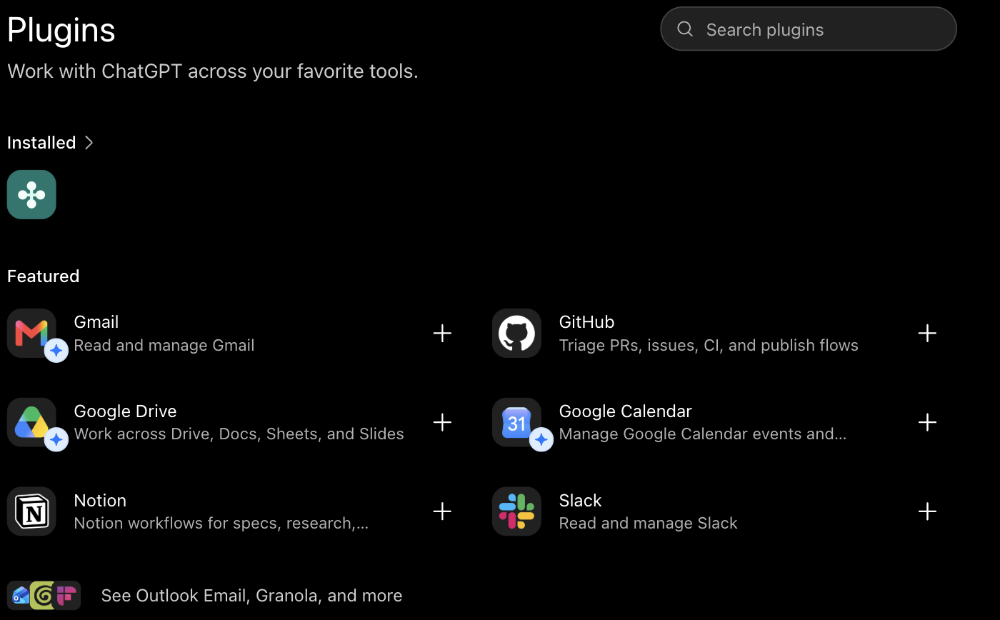
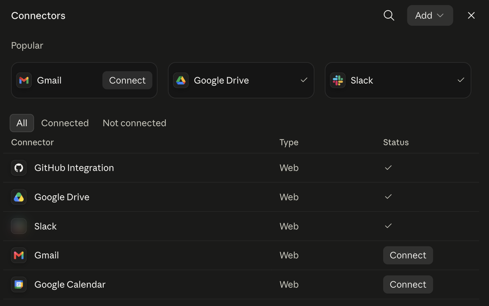
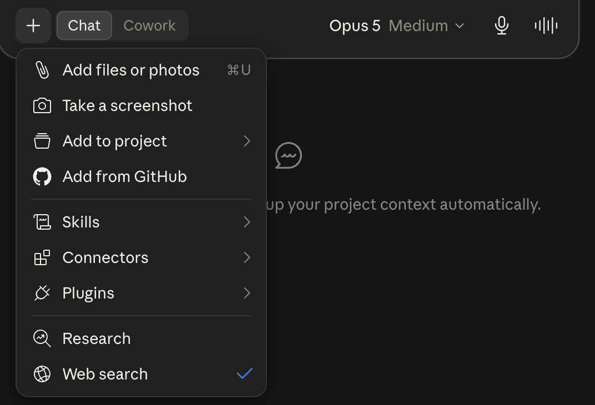

# Lab 2: Connect Your Email

**Estimated time: 30 minutes**
_UI steps verified: **2026-08-19**, Claude (web, Max) and ChatGPT (web, Free)._

## Learning objectives

- Connect a real application to your agent
- Understand what a connector actually grants, and to whom
- Point your Lab 1 agent at live mail instead of a file
- See what breaks when the input stops being tidy

## What you'll build

Lab 1's agent read a file you handed it. Now it goes and gets its own input:

```
    ┌─────────────┐   OAuth    ┌─────────┐
    │  your agent │ ─────────► │  Gmail  │
    └─────────────┘            └─────────┘
           │  reads real messages
           ▼
       structured verdicts
```

> ## ⚠️ Use the burner account
>
> Connect the **throwaway Gmail account from `SETUP.md`**, not your personal or work mail.
>
> This isn't ceremony. You are about to grant a third-party service read access to a mailbox,
> and in Lab 4 you will deliberately feed that mailbox hostile content. Neither of those
> belongs anywhere near real correspondence. If you skipped the setup step, make the account
> now; it takes two minutes and you'll need somewhere to send the Lab 4 payload anyway.
>
> Corporate Workspace accounts frequently block third-party OAuth outright. If yours does,
> that is a finding, not a failure, note it and use the burner.

---

## Concept: a connector is a delegation of your access

When you connect Gmail, you are not giving the AI your password. You're completing an OAuth
flow that issues a **token**. That token carries specific scopes: read messages, maybe send
them, maybe change labels. From then on the agent acts as you, within those scopes, without
asking again.

Three things worth internalizing before you click Allow:

1. **Read the scopes on the consent screen.** "Read and manage Gmail" is not the same
   permission as "read Gmail," and the difference is whether a confused agent can delete
   your mail.
2. **The grant persists.** It doesn't expire when you close the tab. It lives until you
   revoke it. For Google, that is in your account's third-party access settings.
3. **Everything the agent reads goes to the model.** The message bodies leave your mailbox
   and enter a context window on someone else's infrastructure. For a burner account full of
   test mail that's fine. Make the same decision consciously for anything real.

Security teams care most about the third point. It is why "just connect it" is not a call one
engineer gets to make alone in a regulated environment.

## Step 1: Connect Gmail

> ### 🅐 ChatGPT
>
> 1. In the left sidebar, click **Plugins**.
> 2. Under **Featured**, find **Gmail** ("Read and manage Gmail") and click the **+**.
> 3. Complete the Google sign-in and consent flow **with your burner account**.
>
> 

> ### 🅑 Claude
>
> 1. Open **Settings → Customize → Connectors**. (If you land on a page saying connectors
>    have moved, that's the right redirect, follow it to **Customize**.)
> 2. **Gmail** is listed under **Popular**. Click **Connect**.
> 3. Complete the Google sign-in and consent flow **with your burner account**.
>
> 

**Before you click Allow, read the consent screen and write down what it asks for.** You'll
need it in a moment.

| | |
|---|---|
| Scopes requested | |
| Can it *send* mail as you? | |
| Can it *delete* mail? | |

## Step 2: Confirm the agent can see it

Open your `Phishing Triage Analyst` project and ask:

```text
How many messages are in my inbox right now, and what are the subjects of the
five most recent?
```

If it can't see anything, the connector isn't enabled for this conversation, check the
composer's **+** menu (Claude) or that the plugin is switched on (ChatGPT).

> ### 🅑 Claude's tool menu
> Web search, Connectors, Skills, and Plugins all live behind the **+** in the message box.
> A checkmark means it's active for this conversation:
>
> 

## Step 3: Triage live mail

Your Lab 1 instructions are still in force. Point them at the inbox:

```text
Triage the 10 most recent messages in my inbox using your existing instructions.
Return the JSON array, one object per message.
```

Watch what happens, and expect it to be messier than Lab 1. Record what breaks:

| Problem | Did you hit it? | What the agent did |
|---|---|---|
| No authentication headers available | | |
| HTML mail rendered as noise | | |
| Threads / quoted replies confusing the verdict | | |
| Marketing mail classified as phishing | | |
| Missing fields your schema requires | | |

**This is the real content of the lab.** Your Lab 1 agent scored well because `emails.json`
was clean, complete, and shaped like the schema. Real mail is none of those things. Most AI
projects fail in the gap between "works on the sample" and "works on the inbox", and you just
watched that gap open in about ninety seconds.

## Step 4: Fix one thing

Pick the single worst failure from your table and amend your instructions to handle it.
Suggestions:

- If headers are missing: tell the agent to treat authentication as *unknown* instead of
  *failed*, and to lower its confidence. A missing signal is not a bad signal.
- If marketing mail trips it: add a `bulk_marketing` category so commercial mail stops being
  forced into a phishing-or-legitimate choice.
- If HTML noise dominates: instruct it to reason over visible text and treat markup as
  low-signal.

Re-run Step 3. Did the fix hold? Did it break something else?

```text
Re-triage those same 10 messages. Tell me which verdicts changed from the
previous run and why.
```

## Step 5: The question to sit with

You have given a system you cannot fully predict ongoing access to your mailbox, and pointed
it at messages written by strangers.

```text
Based on the permissions I granted you, what are you able to do in my mailbox
that I might not have intended? Be specific and honest.
```

Read that answer carefully. Keep it in mind for Lab 4, where someone writes a message aimed
at your agent.

---

## Checkpoint

- [ ] Gmail is connected using a **burner** account
- [ ] I read the consent screen and recorded the scopes
- [ ] My agent can list messages from the inbox
- [ ] I triaged 10 real messages and recorded what broke
- [ ] I fixed one failure mode and re-ran
- [ ] I know how to revoke this grant

## Think about it

1. Which of your Lab 1 failures were dataset problems instead of agent problems? How would
   you have found out without connecting real mail?
2. The agent reads your mail and the model provider processes it. Write the one-sentence
   version of that you'd have to put in front of a security review.
3. You granted this in about four clicks. What would the equivalent access request look like
   through your organization's normal process, and how long would it take?

**Next:** [Lab 3, Tools and routing](Lab_3_Tools_and_Routing.md), where you make the agent
gather evidence and decide how hard to look.
